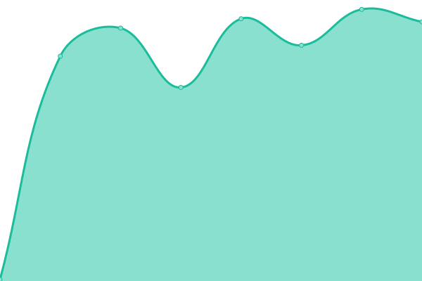
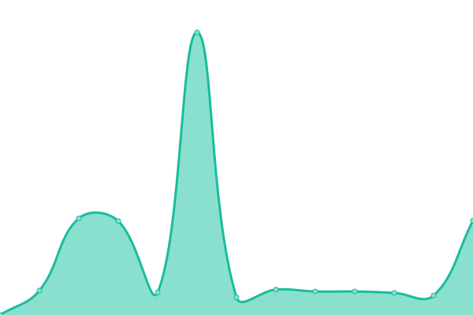
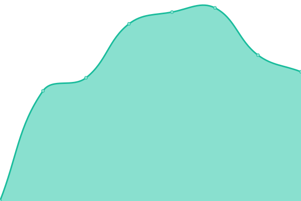

# [📈 Live Status](https://demo.upptime.js.org): <!--live status--> **🟩 All systems operational**

This repository contains the open-source uptime monitor and status page for [Codustry](https://www.codustry.com), powered by [Upptime](https://github.com/upptime/upptime).

With [Upptime](https://upptime.js.org), you can get your own unlimited and free uptime monitor and status page, powered entirely by a GitHub repository. We use [Issues](https://github.com/codustry/gebwai_status/issues) as incident reports, [Actions](https://github.com/codustry/gebwai_status/actions) as uptime monitors, and [Pages](https://demo.upptime.js.org) for the status page.

<!--start: status pages-->
<!-- This summary is generated by Upptime (https://github.com/upptime/upptime) -->
<!-- Do not edit this manually, your changes will be overwritten -->
<!-- prettier-ignore -->
| URL | Status | History | Response Time | Uptime |
| --- | ------ | ------- | ------------- | ------ |
|  [gebwai.com](https://gebwai.com) | 🟩 Up | [gebwai-com.yml](https://github.com/codustry/gebwai_status/commits/HEAD/history/gebwai-com.yml) | 

 433ms
     
 | 

<a href="https://status.gebwai.com/history/gebwai-com">100.00%</a>
    

|  liff | 🟩 Up | [liff.yml](https://github.com/codustry/gebwai_status/commits/HEAD/history/liff.yml) | 

 319ms
     
 | 

<a href="https://status.gebwai.com/history/liff">100.00%</a>
    

|  server | 🟩 Up | [server.yml](https://github.com/codustry/gebwai_status/commits/HEAD/history/server.yml) | 

 3336ms
     
 | 

<a href="https://status.gebwai.com/history/server">100.00%</a>
    

|  [LINE API](https://api.line.me/v2/bot/channel/webhook/endpoint) | 🟩 Up | [line-api.yml](https://github.com/codustry/gebwai_status/commits/HEAD/history/line-api.yml) | 

 450ms
     
 | 

<a href="https://status.gebwai.com/history/line-api">100.00%</a>
    

<!--end: status pages-->

[**Visit our status website →**](https://demo.upptime.js.org)

## 📄 License

- Powered by: [Upptime](https://github.com/upptime/upptime)
- Code: [MIT](./LICENSE) © [Codustry](https://www.codustry.com)
- Data in the `./history` directory: [Open Database License](https://opendatacommons.org/licenses/odbl/1-0/)
